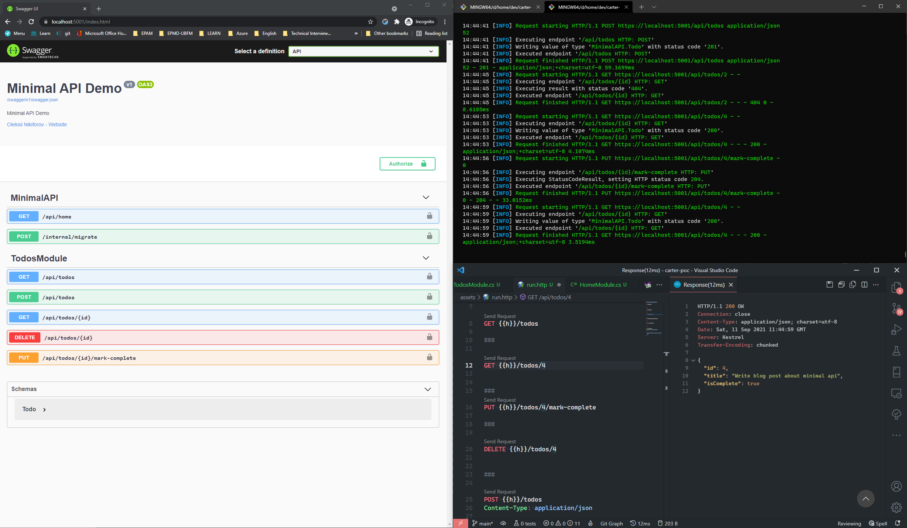

# Modular Minimal API in .NET 6

Todo application that shows you how to apply Modular Minimal API recommendations.

```csharp
var builder = WebApplication.CreateBuilder(args);

builder.AddSerilog();
builder.AddSwagger();
builder.AddAuthentication();
builder.AddAuthorization();
builder.Services.AddCors();
builder.AddStorage();

builder.Services.AddCarter();

var app = builder.Build();
var environment = app.Environment;

app
    .UseExceptionHandling(environment)
    .UseSwaggerEndpoints(routePrefix: string.Empty)
    .UseAppCors()
    .UseAuthentication()
    .UseAuthorization();

app.MapCarter();

app.Run();
```

```bash
$ tree ./Features
.
├── HomeModule.cs
└── TodosModule.cs
```

```http
POST {{h}}/todos
Content-Type: application/json

{
  "title": "Write blog post about minimal api"
}


GET {{h}}/todos


PUT {{h}}/todos/4/mark-complete
```

## Build and Run

Clone the repository and enter `dotnet run`.

### Demo

Please see `assets/run.http` for more details.


